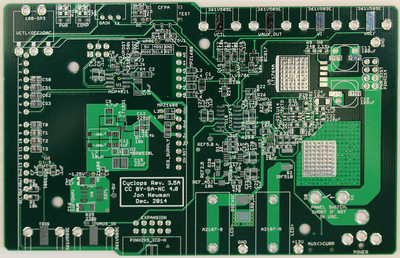
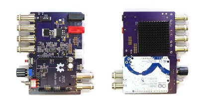
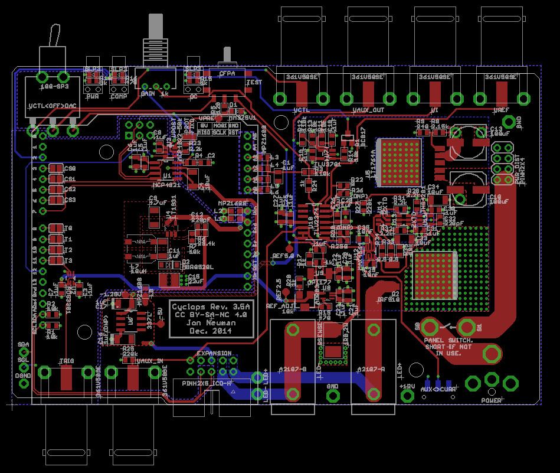
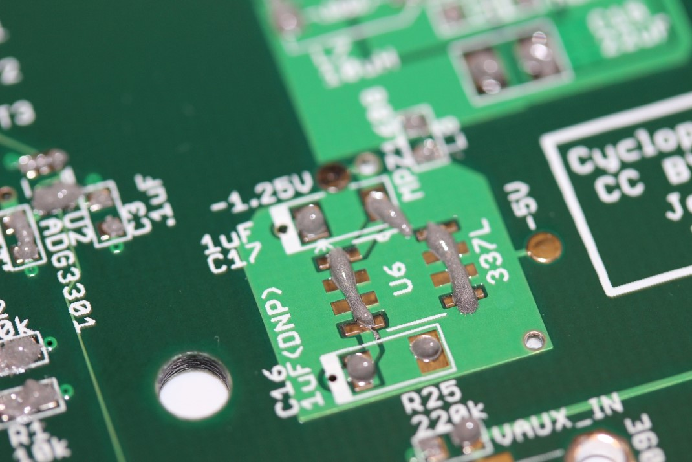
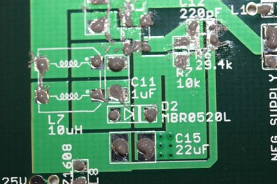

__Cyclops__ is a high-power LED driver that enables precise control of light
power for optogenetic stimulation. The circuit was developed by Jon Newman
while in Steve Potter's lab at Georgia Tech in order to complete his thesis
work, which required the delivery of ultra-precise, continuously time-varying
light waveforms for optogenetic stimulation [1].  This was, and still is, not
possible with commercial hardware for optogenetic stimulation. Since its first
use, the circuit has been improved in terms of speed, precision,
programmability, and ease of use. This document provides construction, usage,
and performance documentation for the Cyclops LED driver. This document evolves
with the repository. To view old revisions, checkout tags or old commits using
their SHA.

<!-- START doctoc generated TOC please keep comment here to allow auto update -->
<!-- DON'T EDIT THIS SECTION, INSTEAD RE-RUN doctoc TO UPDATE -->
**Table of Contents**  *generated with [DocToc](https://github.com/thlorenz/doctoc)*

- [Features](#features)
- [Performance Specifications](#performance-specifications)
- [Usage](#usage)
  - [Feedback Modes](#feedback-modes)
    - [Current Feedback Mode](#current-feedback-mode)
    - [Auxiliary Feedback Mode](#auxiliary-feedback-mode)
  - [Stimulus Generation Options](#stimulus-generation-options)
- [Construction](#construction)
  - [Components](#components)
  - [PCB Assembly](#pcb-assembly)
  - [Enclosure](#enclosure)
  - [Circuit testing](#circuit-testing)
- [License](#license)
  - [Hardware Licensing <a rel="license"](#hardware-licensing-a-rellicense)
  - [Software Licensing](#software-licensing)
- [References](#references)
- [TODO](#todo)

<!-- END doctoc generated TOC please keep comment here to allow auto update -->

### Features
**Circuit Features**

- Ultra-precise
- High power
- Up to 1.5A per LED
- Wide bandwidth
  - ~2.5 MHz -3 dB bandwidth
  - <200 ns 1.0A rise-time
- Current and optical feedback modes
- Built-in waveform generation
- Over-current protection
- Modular
  - Arduino compatible
  - 4 synchronizable optical channels
  - Accepts external analog, gate, or trigger inputs

**Stimulus Generation Options**

- External stimulus sequencer
- External digital trigger
  - TTL logic level
- External analog waveform generator
  - 0-5V analog signals
- Internal 12-bit DAC
  - Synchronized across up to 4 drivers
  - Powerful Arduino library
  - Programmable triggering logic
  - Respond to USB input

### Performance Specifications
TODO

### Usage
#### Feedback Modes
The main functional component of the device is a feedback assisted, power,
enhancement-mode N-MOSFET
([IRF510](http://www.vishay.com/docs/91015/sihf510.pdf)). Current is drawn from
the source pin of the FET in accordance with one of two feedback modes: **current
feedback** or **auxiliary feedback**. In both modes, the FET acts as a variable
resistor whose resistance is changed in inverse relation to the gate voltage.
The difference between the two modes is in how the gate voltage is regulated.

- In **current feedback mode**, the gate voltage is adjusted such that the
  voltage drop across the sense resistor (RSENSE = 1 ohm in the schematic) is
  equal to a supplied reference voltage.
- In **auxiliary feedback mode**, some external voltage that has a positive and
  monotonic relationship with optical power is provided as a feedback signal.
  This is feedback voltage is typically supplied by an amplified photodiode

##### Current Feedback Mode
To use current feedback mode, push the rear slide switch to the CURR position ().
Using the circuit in current feedback mode ensures that the forward current
across the LED is precisely regulated according the voltage at the VREF pin.
This configuration is a standard method for driving LEDs because the
relationship between current and LED irradiance is smooth and monotonic. This
means that more current across the LED will generate more light power (while
staying within the LED's maximum ratings, of course). However, the relationship
between current and irradiance is not linear. For most LEDs, it looks like a
logarithmic function. Additionally, the efficiency of the LED is inversely
related to its temperature. So, as the LED operates and heats up, the amount of
light it produces drops even when the current is held constant. The severity of
an LED's temperature dependence and current/irradiance nonlinearity depend on
the type of LED (roughly, the color and who made it). These properties should
be clearly documented in the LED's data sheet. With a quality LED and proper
thermal management, the effects of temperature and static current/irradiance
nonlinearity are fairly minimal and can be ignored in most situations.

##### Auxiliary Feedback Mode
To use auxilary feedback mode, push the rear slide switch to the AUX position ().
When extremely stable, linear control of light power is required, the auxiliary
feedback input can be used to used to compensate for the temperature dependence
and static nonlinearity of the current/irradiance relationship of the LED. For
example, when the auxiliary voltage is supplied by an amplified photodiode that
is somewhere indecent to radiation from the LED, or is sampled from the fiber
transporting LED light, the gate voltage is adjusted such that the measured
light power matches a DAC-supplied reference voltage.  This is the case in the
circuit diagram. This configuration is referred to as optical feedback mode.
The [PDA36A](https://www.thorlabs.com/thorProduct.cfm?partNumber=PDA36A)
adjustable amplified photodiode from Thorlabs is a good option for supplying
optical feedback. However, you can make your own amplified photodiode for a
fraction of the price, and a design is included within the cyclops repository.
Optical feedback completely linearizes the relationship between a supplied
reference voltage and the light power produced by the LED by compensating for
the current/irradiance nonlinearities and temperature dependence.

#### Stimulus Generation Options
There are three ways to generate light signals using the driver. The behavior
of each of these options is dependent on the feedback mode being used. The
behavior of each input option is described in relation to the feedback mode of
the driver.

1.  The test button is always available and will override all other input
   modes. Using the `TEST` button the behavior of the circuit is:

  -  Source the current specified by the MAX CURR. dial.
  -  Generate the optical power specified by the h * mW
    level that is  specified by the MAX POWER dial. The intensity of the LED
    will be dependent on the auxiliary feedback signal used which defines the
    'h' parameter. 

2.  External input mode is engaged when the SOURCE switch is moved to the EXT
position and user supplied voltage waveforms are present at the EXT BNC input.
If the user attempts to supply more than 5V to the EXT input, the circuit will
clamp the input signal to 5V. Using `EXT` mode, the behavior of the circuit is:

  -  Source the current specified by (EXT Voltage / 5V) *
    MAX CURR. 
  -  Generate the optical power specified by (EXT
    Voltage/5V) * h  * mW. The intensity of the LED will be dependent on the
    auxiliary feedback signal used which defines the 'h' parameter. 

3.  The internal DAC is engaged when the SOURCE switch is moved to the
DAC position and can be used to generate pre-programmed waveforms and waveform
sequences triggered by a digital pulse to the TRIG input. This feature relies
on optional Arduino installation and programming the device using its API.
Using the `DAC` mode, the behavior of the circuit is:

  -  Source the current specified by (DAC Voltage / 5V) *
    MAX CURR. 
  -  Generate the optical power specified by (DAC
    Voltage/5V) * h  * mW. The intensity of the LED will be dependent on the
    auxiliary feedback signal used which defines the 'h' parameter. 

### Construction 
If you have questions during device assembly, please direct them to the
[open-ephys forum](https://groups.google.com/forum/#!forum/open-ephys) so that
others may benefit.

#### Components 
The bill of materials (BOM) required to build a 1,2,3, or 4 devices is
available on [this google
doc](https://docs.google.com/spreadsheets/d/1YQR_ujrZgILNx3XjomLKWgzDvirwKrKaRbVVzmBgk-s/edit?usp=sharing).
Most of the parts can be purchased from Digikey, but there are a few components
that need to be bought from other sources such as Newark, Adafruit, and Samtec.
All vendor, part number, and quantity information is listed on the BOM. If you
are having trouble getting a part, check the BOM since there are alternative
suppliers listed for some parts. As a convenience, the spreadsheet contains
links to a pre-populated Digikey cart (which are optimized for quantity
discounts).

The PCB can be purchased from OSH park
[here](https://oshpark.com/shared_projects/N5vW5JmD) or Seed Studio
[here](http://www.seeedstudio.com/service/). This is a four layer PCB. Note
that OSH park sells a minimum of 3 boards per order and Seed studio sells a
minimum of 5 boards per order. PCB stencils, useful for those performing reflow
or hot-air soldering, can be purchased from a service like [OSH
stencils](https://www.oshstencils.com) using the gerber files located in
`./cyclops/stencil`. If you plan to hand solder the board, then you do not need
to purchase these stencils.

The BOM includes several optional components, which are not in the
pre-populated Digikey cart. These include:

- An __extruded aluminum enclosure__, which houses the completed board. The
  enclosure is recommended because the large voltages and current transients
  used to drive high power LEDs can cause capacitive and inductive interference
  with nearby recording equipment. Acrylic front and rear panels can be
  purchased from Ponoko using the links supplied in the BOM. The instructions
  below show how these plastic pieces are modified to provide proper electrical
  shielding.
- An __M8-4 connector__. This is a rather expensive connector that allows
  cyclops to drive [Thorlabs LED
  modules](https://www.thorlabs.com/newgrouppage9.cfm?objectgroup_id=5206) or
  [Doric LED modules](http://doriclenses.com/life-sciences/243-led-modules).
    
#### PCB 
The cyclops PCB can be constructed by purchasing from one of the
pre-uploaded options:

- [OSH Park](https://oshpark.com/shared_projects/N5vW5JmD) - made in America, excellent quality.
- [Seeed Studio]() - made in China, very good quality.

Alternatively, the [gerber files](./cyclops/gerber/) can be uploaded to the PCB
fabrication service of your choice. The layer of each gerber file is identified
by its file extension:

     *.GKO = board outline 
     *.GTS = top solder mask 
     *.GBS = bottom solder mask
     *.GTO = top silk screen 
     *.GBO = bottom silk screen 
     *.GTL = top copper
     *.G2L = inner layer 2 copper 
     *.G3L = inner layer 3 copper 
     *.GBL = bottom copper 
     *.XLN = drill hits and sizes

#### PCB Assembly 
To assemble the PCB, you will need the following materials

- A soldering device. At minimum, a soldering iron regulated to ~370 deg.  c)
  will do the job. However, a hot-air rework tool or reflow oven are
  recommended and the assembly instructions below assume you are using one of
  these two options. A low cost, high-quality hot-air rework station can be
  purchased from SparkFun [here](https://www.sparkfun.com/products/10706).
- Copper braid ('solder wick') for solder removal (e.g
  [this](https://www.sparkfun.com/products/9327))
- Stereoscope or loupe (Optional) 
- Liquid flux (No-clean variants are easiest since they don't have to be
  removed after use)
- Isopropyl alcohol for cleaning flux off the board (e.g.
  [thos](http://amzn.com/B0047YB3OW); Optional)
- An anti-static mat (e.g. [this](http://amzn.com/B00009XT3H); Optional)

PCB component population and soldering is fairly straightforward and requires
standard surface mount construction techniques.

- A tutorial on hot-air soldering can be found [here](https://youtu.be/1z0IiuQ35HU).
- A great tutorial filled with general tips and tricks for surface mount soldering can be
found [here](https://youtu.be/pdGSFc7VjBE).

The following steps provide a visual guide to construct your own board. The
goal is to create a fully populated PCB like this one: 

_After construction, you should run through the electrical tests outlined in
the next section before applying power to the board._

0. Place the bare PCB on a flat surface, preferably one that is static
   dissipative or anti-static. 

0. Below are pictured some of the materials you will need to construct a board.

    .](./images/SolderPaste.jpg)
  
    
  
    .](./images/DigikeyParts.jpg)
  
    .](./images/SolderPaste.jpg)

0. The silkscreen layer on the PCB (white text) has almost all the information
   you will need to properly populated the PCB. However, its a good ideal to to
   open the [cyclops design](./cyclops/cyclops_r3.brd) in
   [EAGLE](http://www.cadsoftusa.com/eagle-pcb-design-software/). This will
   allow you to get detailed information on components before placing them on
   the board.

    
  
    You can then the `information` tool to get detailed information on each
    component, e.g. to ensure you are placing the correct value resistor or
    capacitor.
  
    

0. After cleaning the surface of the board with isopropyl acholhol or similar,
   apply solder paste to each of the pads. For an excellent series of tips on
   effective methods for dispensing solder paste, see [Mike's video on the
   subject](https://youtu.be/pdGSFc7VjBE). Do not apply solder paste to
   through-holes or the pads shown outlined in red in the following image.
   These will be hand soldered later in the assembly process.

    
  
    The correct amount of solder paste to apply is 'enough'. Each component
    contact should sit in a small amount of paste, but blobs of paste that
    envelop the component pad or pin may later result in a short. The following images
    show examples of good and bad solder placement.
  
    
  
    

    If you need to pause at any point, you should store place the PCB in the
    fridge to prevent the flux in the solder paste from breaking down. 

0. You can look at the picture below and put solder on the exact same gold plates as in the picture. I actually missed some gold plates at this step, but don't worry for now. You can put solder just like this.

    
    <b>Fig. 7</b> <i>After putting solder paste to all necessary slots (a few are missing here) </i> 

    
    <b>Fig. 8</b> <i>Closer look 1. Too much solder in general, but will work</i> 

    
    <b>Fig. 9</b> <i>Closer look 2. Too much solder in general, but will work</i> 

0. Populate all __top-side surface mount__ components on the board. There is a
   single surface mount switch on the back of the board that will be hand
   soldered later. Additionally, all through hole components (e.g. power jack,
   BNC connectors, etc) will be populated later. Start by placing the
   integrated circuits (ICs). Use the stereoscope or loupe to ensure that pads
   are making contact with the pins of the placed components.  Precise
   component alignment is not necessary.  Components will self-align during the
   reflow process.

    

    

0. After placing the ICs, place the passive components (resistors,
   capacitors, inductors, and diodes).  

    

    

0. Next step is to reflow solder. Let me show my homemade reflow oven. You can make a similar one or use a commercial one. Reflow the solder paste on the board using your oven or hot air gun as
described in the links above.  After the solder has cooled, examine solder pads
using the stereoscope of loupe for solder bridges between pins, solder that has
not melted, or pads lacking a decent solder joint Fix any issues using a
standard soldering iron If there are solder bridges present, get rid of them
using some solder wick before moving on.  Solder through-hole components in
place using a standard soldering iron. A low cost reflow oven can be made form a toaster oven as shown here. This link also
contains useful information on the basics of the reflow soldering process,

    
    <b>Fig. 14</b> <i>Carefully bring the PCB and place it in the oven like this.</i> 

    
    <i>Here is a closer look.</i> 

    
    <i>A board...</i> 

    
    <i>As it goes above 200C, the solder starts to reflow. Like a live worm</i> 

0. After reflow, take the PCB out and check for possible shorts. We need to fix it.

    
    <b>Fig. 15</b> <i>See the blob of solder there?</i> 

    
    <b>Fig. 16</b> <i>Use this solder remover and flux</i> 

    
    <b>Fig. 17</b> <i>Bring it to the solder blob and sort of press it down with solder. Then the solder gets absorbed to the remover.</i> 

    
    <b>Fig. 18</b> <i>Problem fixed! There is enough solder after removal, so mostly you don't need to worry about connection.</i> 

    
    <i>By the way, there are some differences between different versions of the board. For example, 1 kOhm there in the middle of the picture was replaced to a 0 ohm one in the newer version.</i> 

0. Now populate all electromechanical parts. The barrel power jack (name: "POWER", value: PJ-063BH on the schematic)
should be mounted on the _bottom_ of the board. It fits on both the top and the
bottom, and will properly supply the board with power if mounted on the top.
However, if the barrel jack is mounted on the top side of the board, it will
not fit inside the enclosure.

    
    <b>Fig. 19</b> <i>After populating all electromechanicals. Front side.</i> 

    
    <b>Fig. 20</b> <i>After populating all electromechanicals. Back side.</i> 

    
    <i>Front side..</i> 

    
    <i>Front side, with different camera focus..</i> 

    
    <i>Back side..</i> 

    
    <i>Back side, with different camera focus..</i> 

0. Don't forget to install the heatsink.

0. The light pipes over the front LEDs need to be seated firmly for the board
to fit inside the enclosure.

0. Each board has an address (0 through 3) that is defined by two solder
jumpers and the location of a ferrite chip. This allows cyclops boards to be
stacked to share a power supply while being driven by a common microcontroller.
For each board that will share a microcontroller, a unique address must be
specified and the solder jumpers and ferrite chip must be soldered in
appropriate positions to reflect this address. See the picture below to better
understand this addressing scheme.

0. Finally, let's install the power switch. You need to hookup wire capable of
handling the currents that the driver requires. AWG 20 (~0.8 mm diameter)
braided copper wire or thicker is recommended. Even if you don't want to use
the power switch, jumper the switch solder points using AWG 20 wire or thicker.

    
    <b>Fig. 21</b> <i>Power switch.</i> 

    
    <b>Fig. 22</b> <i>Front side.</i> 

    
    <b>Fig. 23</b> <i>Back side.</i> 

#### Enclosure
To construct the enclosure, you we will use the following materials

- Phillips head screwdriver (if
you are using the enclosure) 
- A white paint pen (e.g. these)
- Conductive coating for EMI suppression (e.g. this).

#### Circuit testing
To perform basic electrical testing, you we will use the following materials

- Multimeter. A low cost mulitmeter is available from
[sparkfun](https://www.sparkfun.com/products/12966).
- Jeweler's flat head screwdriver.
- Oscilloscope (optional, but recommended for performance verification)

0. Before powering on the device, check for shorts
between power traces on the board. Put your multimeter in continuity mode
Check for shorts between the Digital rail (TPXX) and ground (TPGND) Analog rail
and ground If there is a short, you must track it down and get rid of it before
applying power. If you find a short, test the same contact points on an unpopluated PCB to ensure that it is not due to a PCB fabrication defect. If so, contact your PCB for a return.

### License 
#### Hardware Licensing  Cyclops LED
Driver by <a xmlns:cc="http://creativecommons.org/ns#"
href="https://github.com/jonnew/cyclops" property="cc:attributionName"
rel="cc:attributionURL">Jonathan P. Newman</a> is licensed under a <a
rel="license" href="http://creativecommons.org/licenses/by-nc-sa/4.0/">Creative
Commons Attribution-NonCommercial-ShareAlike 4.0 International License</a>. Based on a work at <a xmlns:dct="http://purl.org/dc/terms/"
href="https://github.com/jonnew/cyclops"
rel="dct:source">https://github.com/jonnew/cyclops</a>.

#### Software Licensing 
Copyright (c) Jonathan P. Newman All right reserved.

The code associated with the Cyclops project is free software: you can
redistribute it and/or modify it under the terms of the GNU General Public
License as published by the Free Software Foundation, either version 3 of the
License, or (at your option) any later version.

The code associated with the Cyclops project is distributed in the hope that it
will be useful, but WITHOUT ANY WARRANTY; without even the implied warranty of
MERCHANTABILITY or FITNESS FOR A PARTICULAR PURPOSE.  See the GNU General
Public License for more details.

You should have received a copy of the GNU General Public License along with
this code.  If not, see <http://www.gnu.org/licenses/>.

### References 
[1] T. Tchumatchenko\*, J.P. Newman\*, M.-f. Fong, S.M. Potter.
[Delivery of time-varying stimuli using
ChR2](http://journal.frontiersin.org/article/10.3389/fncir.2013.00184/full#).
(\* - equal contributions, co-first authors) Front. Neural Circuits (7:184)
2013.  doi: 10.3389/fncir.2013.00184

### TODO
**Revision 3.6**
- [ ] Get [DOC.md](DOC.md) in working order
- [ ] Create an fiber coupled LED interface with integrated optical power
  measurements
  - [In progress](https://github.com/jonnew/cyclops/tree/master/photodiode)
- [ ] High side current sense
- [ ] Arduino gets replaced with a
  [Teensy](https://www.pjrc.com/teensy/teensy31.html).

**Revision 3.5B**
- [ ] Get the board on CircuitHub
- [ ] Get the device on the Open Ephys store
- [ ] The rear panel holes seems to have slight vertical offsets
  - LED jacks: 1 mm to low 
  - Expansion header: 1 mm to low 
  - Aux/curr switch: 0.25 mm to low
  - *EDIT* After further inspection it seems like the expansion header might
    be 90% of the problem. Recheck before making changes.
- [x] The LED polarity labels on the panel are reversed 
- [x] Sometimes, because of intrinsic tolerance issues, the 5.1V zener's
  reverse breakdown is too low and it affects valid signals in the 0-5V range.
  Get a more reasonable value, e.g. 6V, zener.
  - *EDIT* This was due to a bad zener. Ignore this change. 
- [x] Trade out the LT1964A for a LT1764A, which has a 3A output capability and
  a will allow the circuit to read 1.5A instead of crapping out at 1.25 since
  the quiescent circuit is current hog.
- [x] Put some extra through holes in for wire-to-board access to +/- LED,
  digital GND, and I2C bus for EEPROM on thorlabs leds.

