**Cyclops** is a high-power LED driver that enables precise control of
light power for optogenetic stimulation. The circuit was developed by
Jon Newman while in Steve Potter's lab at Georgia Tech in order to
complete his thesis work, which required the delivery of ultra-precise,
continuously time-varying light waveforms for optogenetic stimulation
\[1,2\]. This was, and still is, not possible with commercial hardware
for optogenetic stimulation. Since its first use, the circuit has been
improved in terms of speed, precision, programmability, and ease of use.
This document provides construction, usage, and performance
documentation for the Cyclops LED driver. This document evolves with the
repository. To view old revisions, checkout tags or old commits using
their SHA.

**Note** Github does not render alt text specified in Markdown figures as
captions. Therefore, if you are viewing this document on Github, you will need
to hover over figures to see their captions.

\newpage

**Contributors**

- [jonnew](http://www.mit.edu/~jpnewman/)
- [Sung-Yon Kim](http://www.sungyonkimlab.org/)
- [andersjasp](https://mndrive.umn.edu/brain/people)

**Table of Contents**

- [Attribution](#attribution)
- [Features](#features)
  - [Circuit Features](#circuit-features)
  - [Multiple stimulus generation options](#multiple-stimulus-generation-options)
- [Performance Specifications](#performance-specifications)
  - [Head to Head Comparison](#head-to-head-comparison)
- [Usage](#usage)
  - [Feedback modes](#feedback-modes)
    - [Current Feedback Mode](#current-feedback-mode)
    - [Auxiliary Feedback Mode](#auxiliary-feedback-mode)
  - [Stimulus Generation Options](#stimulus-generation-options)
- [Construction](#construction)
  - [Components](#components)
  - [Board Assembly](#board-assembly)
  - [Enclosure](#enclosure)
- [LED](#led)
- [Quality Control Procedure](#quality-control-procedure)
- [License](#license)
  - [Hardware Licensing](#hardware-licensing)
  - [Software Licensing](#software-licensing)
- [References](#references)

\newpage
Attribution
-----------

It has been a long road to design and test the Cyclops to the point
where it is in active use in many neuroscience labs around the world.
This process has been a lot of work but also a very rewarding learning
experience. I am very happy that this device may enable your scientific
endeavours and I hope it will eventually be one small module in a of
growing set of **high-quality**, **open-source**, and **afforable**
tools that facilitate your research and enable an **open**,
**community-oriented** approach to neuroscience.

I receive no monetary compensation from the sale of these devices. It
would mean a great deal to me if you would consider referencing the
following paper (for which the Cyclops was developed) in published work
that makes use of the Cyclops.

> J.P. Newman, M.-f. Fong, D.C. Millard, C.J. Whitmire, G.B. Stanley,
> S.M. Potter. S.M. Potter. Optogenetic feedback control of neural
> activity. *eLife* (4:e07192) 2015. doi: 10.7554/eLife.07192
> [\[link\]](http://elifesciences.org/content/4/e07192v1)

For instance, in your methods section:

> Optical stimuli were delivered using the Cyclops LED driver (Newman et
> al., 2015; www.github.com/jonnew/Cyclops).

\newpage

Features
--------

### Circuit Features

-   Ultra-precise
-   High power
-   Up to 1.5A per LED
-   Wide bandwidth
    -   \~2.5 MHz -3 dB bandwidth
    -   Maximum 200 ns 1.0A rise-time
-   Current and optical feedback modes
-   Built-in waveform generation
-   Over-current protection
-   Modular
    -   Arduino compatible
    -   4 synchronizable optical channels
    -   Accepts external analog, gate, or trigger inputs

### Multiple stimulus generation options

-   External stimulus sequencer
-   External digital trigger
    -   TTL logic level
-   External analog waveform generator
    -   0-5V analog signals
-   Internal 12-bit DAC
    -   Synchronized across up to 4 drivers
    -   Powerful Arduino library
    -   Programmable triggering logic
    -   Respond to USB input

\newpage

Performance Specifications
--------------------------

The following oscilloscope traces give indicates of the circuit's
precision and speed. Note that time series traces are **not** averaged -
these traces display per-pulse temporal characteristics. Optical
characteristics and optical feedback signal for the Cyclops driver were
provided by a Thorlabs PDA36 amplified photodiode set to 0 dB of
transimpedance gain. Measurements were performed a single Osram golden
dragon LED.

The following traces are the same as the previous ones except that the
amplified photodiode was used to provide optical feedback. The slowdown
compared to current feedback is due to a speed of the photodiode. A
faster amplified photodiode would provide crisper rise and fall times

The current-feedback mode -3dB bandwidth was determined by applying a
flat noise signal over 50 MHz with mean = 1.0V and Vpp = 500 mV into the
`EXT` port with maximal current gain. It occurs at around 2.5 MHz.

\FloatBarrier
\newpage

### Head to Head Comparison
The table below provides a comparisons between Cyclops Rev. 3C and various
commercially available  LED drivers. Measurements were performed using the same
signal generator and LED across drivers. Optical characteristics and optical
feedback signal for the Cyclops driver were provided by a [Thorlabs PDA36 amplified photodiode](http://www.thorlabs.com/thorproduct.cfm?partnumber=PDA36A-EC) 
set to 0 dB of transimpedance gain.

<table border="1" bordercolor="transparent" style="background-color:"transparent" width="100%" cellpadding="3" cellspacing="3">
    <tr>
    	<td></td>
        <td align="center"><b><a href="http://www.plexon.com/products/plexbright-ld-1-single-channel-led-driver">Plexon LD-1</a></b></td>
        <td align="center"><b><a href="http://www.plexon.com/products/plexbright-4-channel-controller-radiant-20">Plexon PlexBright</a>1</b></td>
        <td align="center"><b><a href="http://www.thorlabs.com/newgrouppage9.cfm?objectgroup_id=3832&pn=DC4100">Thorlabs DC4100</a></b></td>
        <td align="center"><b>Cyclops (Current FB)</b></td>
        <td align="center"><b>Cyclops (Optical FB)</b></td>
   	</tr>

    <tr>
    	<td colspan="6"><b>Speed</b></td>
    </tr>
    <tr>
    	<td>10-90% rise time2 (&#x3bcs)</td>
        <td align="center">49</td>
        <td align="center">76</td>
        <td align="center">?</td>
        <td align="center">0.1</td>
        <td align="center">0.53</td>
    </tr>
    <tr>
    	<td>90-10% fall time2 (&#x3bcs)</td>
        <td align="center">39</td>
        <td align="center">89</td>
        <td align="center">?</td>
        <td align="center">0.4</td>
        <td align="center">0.46</td>
    </tr>
    <tr>
    	<td>Dead time, worst case2 (&#x3bcs)</td>
        <td align="center">140</td>
        <td align="center">160</td>
        <td align="center">?</td>
        <td align="center">3.0</td>
        <td align="center">3.0</td>
    </tr>
    <tr>
    	<td>Small signal -3dB bandwidth4 (kHz)</td>
        <td align="center">10.5</td>
        <td align="center">?</td>
        <td align="center">100 kHz3,5</td>
        <td align="center">2.5 MHz</td>
        <td align="center">2.5 MHz</td>
    </tr>

    <tr>
    	<td colspan="6"><b>Accuracy</b></td>
    </tr>
    <tr>
    	<td>Overshoot2 (%)</td>
        <td align="center">0</td>
        <td align="center">0</td>
        <td align="center">?</td>
        <td align="center">7 (Depends on LED cabling) </td>
        <td align="center">3 (Depends on LED and photodetector cabling)</td>
    </tr>
    <tr>
    	<td>THD6 (%)</td>
        <td align="center">8.29</td>
        <td align="center">?</td>
        <td align="center">?</td>
        <td align="center">8.2</td>
        <td align="center">0.41</td>
    </tr>
    <tr>
    	<td colspan="6"><b>Power</b></td>
    </tr>
    <tr>
    	<td>Max current drive (mA)</td>
        <td align="center">1200</td>
        <td align="center">1100</td>
        <td align="center">1000</td>
        <td colspan="2" align="center">1500</td>
    </tr>

    <tr>
    	<td colspan="6"><b>Features</b></td>
    </tr>
    <tr>
    	<td>Independent LED channels</td>
        <td align="center">1</td>
        <td align="center">4</td>
        <td align="center">4</td>
        <td align="center" colspan="2"> 1 (modular; can stack up to 4 devices)</td>
    </tr>
	<tr>
    	<td>Regulated current output</td>
        <td align="center">&#x2713</td>
        <td align="center">&#x2713</td>
        <td align="center">&#x2713</td>
        <td align="center">&#x2713</td>
        <td align="center">N/A</td>
    </tr>
	<tr>
    	<td>Regulated optical output</td>
        <td align="center">&#x2717</td>
        <td align="center">&#x2717</td>
        <td align="center">&#x2717</td>
        <td align="center">N/A</td>
        <td align="center">&#x2713</td>
    </tr>
    <tr>
    	<td>Programmable, hardware-based overcurrent protection</td>
        <td align="center">&#x2717</td>
        <td align="center">&#x2717</td>
        <td align="center">&#x2713</td>
        <td colspan="2" align="center">&#x2713</td>
    </tr>
    <tr>
    	<td>Internal arbitrary waveform generation</td>
        <td align="center">&#x2717</td>
        <td align="center">&#x2713</td>
        <td align="center">&#x2717</td>
        <td colspan="2" align="center">&#x2713</td>
    </tr>
    <tr>
    	<td>Independent DAC for each LED</td>
        <td align="center">N/A</td>
        <td align="center">&#x2717</td>
        <td align="center">N/A</td>
        <td colspan="2" align="center">&#x2713</td>
    </tr>
    <tr>
    	<td>Modular design</td>
        <td align="center">&#x2717</td>
        <td align="center">&#x2717</td>
        <td align="center">&#x2717</td>
        <td colspan="2" align="center">&#x2713</td>
    </tr>
    <tr>
    	<td>Manual pulse</td>
        <td align="center">&#x2713</td>
        <td align="center">&#x2717</td>
        <td align="center">&#x2717</td>
        <td colspan="2" align="center">&#x2713</td>
    </tr>
    <tr>
    	<td>Outputs</td>
        <td align="center">None</td>
        <td align="center">None</td>
        <td align="center">None</td>
        <td colspan="2" align="center">Reference voltage, LED current, optical power (if measured)</td>
    </tr>
    <tr>
    	<td>LCD display</td>
        <td align="center">&#x2713</td>
        <td align="center">&#x2717</td>
        <td align="center">&#x2713</td>
        <td colspan="2" align="center">&#x2717</td>
    </tr>

    <tr>
    	<td colspan="6"><b>Programmability</b></td>
    </tr>
	<tr>
    	<td>Open-source</td>
        <td align="center">&#x2717</td>
        <td align="center">&#x2717</td>
        <td align="center">&#x2717</td>
        <td colspan="2" align="center">&#x2713</td>
    </tr>
    <tr>
    	<td>Driver</td>
        <td align="center">N/A</td>
        <td align="center">"Radiant" software</td>
        <td align="center"><a href="http://www.ni.com/visa/">NI-VISA</a> based GUI and API</td>
        <td colspan="2" align="center">Arduino compabile</td>
    </tr>
    <tr>
    	<td>Interface</td>
        <td align="center">N/A</td>
        <td align="center">GUI/USB cable</td>
        <td align="center">GUI or API/USB cable</td>
        <td colspan="2" align="center">Arduino IDE/USB cable</td>
    </tr>
    <tr>
    	<td>Waveform generation performance</td>
        <td align="center">N/A</td>
        <td align="center">10 kHz aggregate update across channels</td>
        <td align="center">N/A</td>
        <td colspan="2" align="center">100 kHz/channel update; evolves with Arduino tools</td>
    </tr>
    <tr>
    	<td>OS compatibility</td>
        <td align="center">N/A</td>
        <td align="center">Windows</td>
        <td align="center">Windows</td>
        <td colspan="2" align="center">Windows, Linux, Mac</td>
    </tr>

    <tr>
    	<td><b>Cost</b></td>
        <td align="center"><b>$700.00</b></td>
        <td align="center"><b>$5300.00</b></td>
        <td align="center"><b>$3059.07</b></td>
        <td align="center"><b>~$160.00</b>8</td>
        <td align="center"><b>~$200.008,9</b></td>
    </tr>
</table>

1. Essential drive circuit consists of an [Opal-Kelly XEM6001 FPGA Dev board](http://www.opalkelly.com/products/xem6001/) tied to 4 commercially available [buck converters from Recon](http://www.recom-power.com/pdf/Lightline/RCD-24.pdf).
2. Test signal: 500 Hz, 50% duty-cycle square wave resulting in 1A peak to peak through LED.
3. Test signal: 1 kHz 500 mA offset, 100 mA peak-to-peak sine wave.
4. Not measured on the bench top. Taken from manufacturer's specifications.
5. Bandwidth threshold (e.g. -3 dB) was not specified. Applies to sine wave only.
6. Test signal: 1 kHz 500 mA offset, 1A peak-to-peak sine wave.
7. Includes the cost of the [DC4100-HUB](http://www.thorlabs.com/thorproduct.cfm?partnumber=DC4100-HUB) which is required to drive four LEDs.
8. Approximate materials cost.
9. Increased cost compared to current feedback mode is due to amplified photodiode (design included with Cyclops repository).

Usage
-----

The cyclops is a device that is capable of transforming voltage signals
(e.g. sine waves, square pulses, etc.) into optical signals from
high-power LEDs. Voltage signals to drive the device can be generated
internally using an on-board digital to analog converter or can be
delivered from an external source, such as a function generator or
stimulus sequencer. The cyclops provides numerous measurements of
circuit operation that can be recorded during an experiment such as LED
current and stimulus reference voltages. The device can be controlled
over a USB interface using its [Arduino library](./arduino/cyclops/).
The device also can be configured to drive commercially available LED
modules from Thorlabs and Doric.

Below we provide an explanation of the operational modes of the device
and the different ways it can be used to generate optical stimuli. Refer
to the above diagram to locate the physical switches, dials, and
connectors corresponding to verbal or iconic descriptions device
settings.

### Feedback modes

#### Current Feedback Mode

To use current feedback mode, push the `F.B. MODE` slide switch to the
`CURR` position (). Using the circuit in current
feedback mode ensures that the forward current across the LED is
precisely regulated according the voltage at the `VREF` pin. This
configuration is a standard method for driving LEDs because the
relationship between current and LED irradiance is smooth and monotonic.
This means that more current across the LED will generate more light
power (while staying within the LED's maximum ratings, of course).
However, the relationship between current and irradiance is not linear.
For most LEDs, it looks like a logarithmic function. Additionally, the
efficiency of the LED is inversely related to its temperature. So, as
the LED operates and heats up, the amount of light it produces drops
even when the current is held constant. The severity of an LED's
temperature dependence and current/irradiance nonlinearity depend on the
type of LED (roughly, the color and who made it). These properties
should be clearly documented in the LED's data sheet. With a quality LED
and proper thermal management, the effects of temperature and static
current/irradiance nonlinearity are fairly minimal and can be ignored in
most situations.

#### Auxiliary Feedback Mode

To use auxiliary feedback mode, push the `F.B. MODE` slide switch to the
`AUX` position (). When extremely stable, linear
control of light power is required, the auxiliary feedback input can be
used to used to compensate for the temperature dependence and static
nonlinearity of the current/irradiance relationship of the LED. For
example, when the auxiliary voltage is supplied by an amplified
photodiode that is somewhere indecent to radiation from the LED, or is
sampled from the fiber transporting LED light, the gate voltage is
adjusted such that the measured light power matches a DAC-supplied
reference voltage. This is the case in the circuit diagram. This
configuration is referred to as optical feedback mode. The
[PDA36A](https://www.thorlabs.com/thorProduct.cfm?partNumber=PDA36A)
adjustable amplified photodiode from Thorlabs is a good option for
supplying optical feedback. However, you can make your own amplified
photodiode for a fraction of the price, and a design is included within
the cyclops repository. Optical feedback completely linearizes the
relationship between a supplied reference voltage and the light power
produced by the LED by compensating for the current/irradiance
nonlinearities and temperature dependence.

### Stimulus Generation Options

There are three ways to generate light signals using the driver. The
behavior of each of these options is dependent on the feedback mode
being used. The behavior of each input option is described in relation
to the feedback mode of the driver.

1.   The test button is
    always available and will override all other input modes. Using the
    `TEST` button the behavior of the circuit is:

-    Source
    the current specified by the `MAX CURR.` dial.
-    Generate
    the optical power specified by the h \* mW level that is specified
    by the `MAX POWER` dial. The intensity of the LED will be dependent
    on the auxiliary feedback signal used which defines the
    'h' parameter.

2.   External input mode is
    engaged when the `SOURCE` switch is moved to the `EXT` position and
    user supplied voltage waveforms are present at the `EXT` BNC input.
    If the user attempts to supply more than 5V to the `EXT` input, the
    circuit will clamp the input signal to 5V. Using `EXT` mode, the
    behavior of the circuit is:

-    Source
    the current specified by (EXT Voltage / 5V) \* MAX CURR.
-    Generate
    the optical power specified by (EXT Voltage/5V) \* h \* mW. The
    intensity of the LED will be dependent on the auxiliary feedback
    signal used which defines the 'h' parameter.

3.   The internal digital
    to analog converter (DAC) is engaged when the `SOURCE` switch is
    moved to the `DAC` position and can be used to generate
    pre-programmed waveforms and waveform sequences triggered by a
    digital pulse to the `TRIG` input. This feature relies on optional
    Arduino installation and programming the device using its API. Using
    the `DAC` mode, the behavior of the circuit is:

-    Source
    the current specified by (DAC Voltage / 5V) \* MAX CURR.
-    Generate
    the optical power specified by (DAC Voltage/5V) \* h \* mW. The
    intensity of the LED will be dependent on the auxiliary feedback
    signal used which defines the 'h' parameter.

\FloatBarrier
\newpage

### Programming the onboard microcontroller

TODO

Construction
------------

If you have questions during device assembly, please direct them to the
[open-ephys forum](https://groups.google.com/forum/#!forum/open-ephys)
so that others may benefit. Pull requests improving this documentation
are welcome.

### Components

1.  This google sheet contains a reasonably up-to-date parts list.
    However, it is manually managed and therefore prone to errors. It is
    recommended that method 2 be used instead

    [Google Doc
    List](https://docs.google.com/spreadsheets/d/1YQR_ujrZgILNx3XjomLKWgzDvirwKrKaRbVVzmBgk-s/edit?usp=sharing)

2.  Fully assembled cyclops PCBs can be purchased from Circuit Hub

    [Cyclops on Circuit
    Hub](https://circuithub.com/projects/jonnew_/cyclops)

    This also includes an up-to-date parts list for each PCB with
    optimized prices. *Note that these parts are for a single PCB
    without the enclosure, power supply, etc*. Those parts can be found
    on the "Circuit Hub Kit" tab of the Google spreadsheet above.

Most of the parts can be purchased from Digikey, but there are a few
components that need to be bought from other sources such as Newark,
Adafruit, and Samtec. All vendor, part number, and quantity information
is listed on the BOM. If you are having trouble getting a part, check
the Google Sheet as there are alternative suppliers listed for some
parts.

The cyclops PCB can be constructed by purchasing from one of the
pre-uploaded options:

-   [OSH Park](https://oshpark.com/shared_projects/fOfw7acB) - made in
    America, excellent quality. Minimum of 3 boards per order
-   [Seeed Studio](http://www.seeedstudio.com/service/index.php?r=pcb) -
    made in China, very good quality. Minimum of 5 boards per order.

Alternatively, the [gerber files](./cyclops/gerber/) can be uploaded to
the PCB fabrication service of your choice. The layer of each gerber
file is identified by its file extension:

     *.GKO = board outline
     *.GTS = top solder mask
     *.GBS = bottom solder mask
     *.GTO = top silk screen
     *.GBO = bottom silk screen
     *.GTL = top copper
     *.G2L = inner layer 2 copper
     *.G3L = inner layer 3 copper
     *.GBL = bottom copper
     *.XLN = drill hits and sizes

PCB stencils, which are useful for applying solder paste to the boards,
can be purchased from a service like [OSH
stencils](https://www.oshstencils.com) using the gerber files located in
[./cyclops/stencil/](./cyclops/stencil/). If you plan to hand solder the
board, or don't mind dispensing solder paste yourself, then you do not
need to purchase these stencils.

The BOM includes several optional components, which are not in the
pre-populated Digikey cart. These include:

-   An **extruded aluminum enclosure**, which houses the
    completed board. The enclosure is recommended because the large
    voltages and current transients used to drive high power LEDs can
    cause capacitive and inductive interference with nearby
    recording equipment. Acrylic front and rear panels can be purchased
    from Ponoko using the links supplied in the BOM. The instructions
    below show how these plastic pieces are modified to provide proper
    electrical shielding.
-   An **M8-4 connector**. This is a rather expensive connector that
    allows cyclops to drive [Thorlabs LED
    modules](https://www.thorlabs.com/newgrouppage9.cfm?objectgroup_id=5206)
    or [Doric LED
    modules](http://doriclenses.com/life-sciences/243-led-modules).

### Board Assembly

#### Materials
To assemble a Cyclops board, you will need the following materials

-   A soldering iron and, if possible, a hot-air reflow device.
    -   At minimum, a soldering iron regulated to \~370 deg. c) will do
        the job.
    -   In addition to the iron, a hot-air rework tool or reflow oven
        are recommended and the assembly instructions below assume you
        are using one of these two options. A low cost, high-quality
        hot-air rework station can be purchased from SparkFun
        [here](https://www.sparkfun.com/products/10706).

    .](./resources/HeatGun.jpg)

-   Copper braid ('solder wick') for solder removal (e.g
    [this](https://www.sparkfun.com/products/9327))
-   Liquid flux (`no-clean` variants are easiest since they don't have
    to be thoroughly removed after use)
-   Solder paste (e.g.
    [this](http://www.digikey.com/product-detail/en/SMD291AX10T5/SMD291AX10T5-ND/3972568))

    .](./resources/SolderPaste.jpg)

-   Stereoscope or loupe (optional but nice for tracking down shorts.)
-   Isopropyl alcohol for cleaning flux off the board (e.g.
    [this](http://amzn.com/B0047YB3OW); optional)
-   An anti-static mat (e.g. [this](http://amzn.com/B00009XT3H);
    optional but recommended to protect your work...)

#### Assembly Instructions
PCB component population and soldering is fairly straightforward and
requires standard surface mount construction techniques.

-   A tutorial on hot-air soldering can be found
    [here](https://youtu.be/1z0IiuQ35HU).
-   A great tutorial filled with general tips and tricks for surface
    mount soldering can be found [here](https://youtu.be/pdGSFc7VjBE).

The following steps provide a visual guide to construct your own board.
The goal is to create a fully populated PCB like this one:

*Following board construction, you should run through the electrical
tests outlined in the next section before applying power.*

1.  Place the bare PCB on a flat surface, preferably one that is static
    dissipative or anti-static. Alternatively, the board can be mounted
    in a PCB vice.

    

1.  The silkscreen layer on the PCB (white text) has almost all the
    information you will need to properly populated the PCB. However,
    its a good ideal to to open the [cyclops
    design](./cyclops/cyclops_r3.brd) in
    [EAGLE](http://www.cadsoftusa.com/eagle-pcb-design-software/). This
    will allow you to get detailed information on components before
    placing them on the board.

    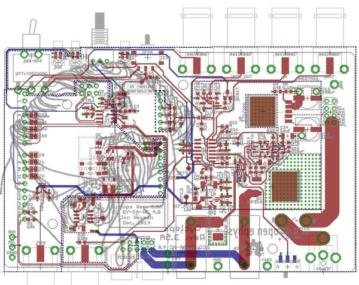

    You can then the `information` tool to get detailed information on
    each component, e.g. to ensure you are placing the correct value
    resistor or capacitor.

    

3.  After cleaning the surface of the board with isopropyl acholhol or
    similar, apply solder paste to each of the pads. For an excellent
    series of tips on effective methods for dispensing solder paste, see
    [Mike's video on the subject](https://youtu.be/pdGSFc7VjBE). Do not
    apply solder paste to through-holes or the pads shown outlined in
    red in the following image. These will be hand soldered later in the
    assembly process.

    The correct amount of solder paste to apply is \`enough'. Each
    component contact should sit in a small amount of paste, but blobs
    of paste that envelop the component pad or pin may later result in
    a short. The following images show examples of good and bad
    solder placement.

    

    

    If you need to pause at any point, you should store place the PCB in
    the fridge to prevent the flux in the solder paste from
    breaking down.

4.  Populate all **top-side surface mount** components on the board.
    There is a single surface mount switch on the back of the board that
    will be hand soldered later. Additionally, all through hole
    components (e.g. power jack, BNC connectors, etc) will be
    populated later. Start by placing the integrated circuits (ICs). Use
    the stereoscope or loupe to ensure that pads are making contact with
    the pins of the placed components. Precise component alignment is
    not necessary. Components will self-align during the reflow process.

    

    

5.  After placing the ICs, place the passive components (resistors,
    capacitors, inductors, diodes, and ferrite chips).

    

    

6.  Next, reflow solder the board. We use a homemade reflow oven
    constructed from a toaster oven, Arduino board, [reflow oven control
    shield](http://www.rocketscream.com/shop/reflow-oven-controller-shield-arduino-compatiblee),
    and [mains relay](https://www.adafruit.com/products/268). You can
    make a similar one, use a commercial reflow oven, or use the hot
    air station. Reflow the solder paste on the board using your oven or
    hot air gun as described in the links above.

    

    

7.  After the solder has cooled, examine solder pads using the
    stereoscope of loupe for solder bridges between pins, solder that
    has not melted, or pads lacking a decent solder joint. Fix any
    issues using a standard soldering iron If there are solder bridges
    present, get rid of them using some solder wick before moving on.
    Solder through-hole components in place using a standard
    soldering iron. A low cost reflow oven can be made form a toaster
    oven as shown here. This link also contains useful information on
    the basics of the reflow soldering process,

    

    

    

    

8.  Each board has an address (0 through 3) that is defined by two
    solder jumpers and the location of a ferrite chip. This allows
    cyclops boards to be stacked to share a power supply while being
    driven by a common microcontroller. For each board that will share a
    microcontroller, a unique address must be specified and the solder
    jumpers and ferrite chip must be soldered in appropriate positions
    to reflect this address. See the picture below to better understand
    this addressing scheme.

    TODO: Pictures of circled 0 ohm jumpers

9.  Flip the board over and install the final surface mount component,
    the `AUX<>CURR` slide switch, by hand soldering.

10. Next, populate all electromechanical components. This can be
    soldered in place with a standard soldering iron and a large
    chisel tip.

    

    

    **Note:** The the barrel power jack (name: `POWER`, value: PJ-063BH
    on the schematic) should be mounted on the **bottom** of the board.
    It fits on both the top and the bottom, and will properly supply the
    board with power if mounted on the top. However, if the barrel jack
    is mounted on the top side of the board, it will not fit inside
    the enclosure.

11. If you are not planning on putting the PCB in an enclosure, jumper the
    solder points for the power switch together using AWG 20 (\~1.8 mm
    diameter) braided copper wire or thicker.

    TODO: Picture of jumpered switch solder points

12. Install the heatsink on the PCB

    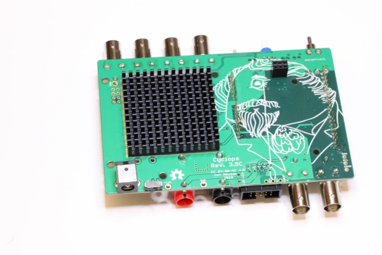

    Flip the PCB so that the bottom is exposed.  Locate the large white square
    surrounding the exposed copper pad indicating the heatsink mounting location.
    Remove the paper backing from the heatsink to expose the adhesive surface
    Press the heatsink into place on the PCB.

13. [Optional] Install the Arduino

    TODO: Image of desoldering and mounting

    Remove the power jack from the Arduino using a hot air gun or desoldering
    tool. Press the Arduino the dedicated headers.

\FloatBarrier
\newpage

### Enclosure

#### Materials
To construct the enclosure, you will use the following materials

**Parts**

1. Assembled Cyclops PCB (1x)
2. Extruded aluminum enclosure (1x)
3. Laser-cut enclosure panels (1x front, 1x rear)
4. Rocker switch (1x)
5. Hookup wire (2x, 15 cm lengths, 20 Ga or thicker)
6. Shrink tube (2x)
8. Gain knob (1x)
9. Toothed washer (1x)
10. Jam nut (1x)
11. Light pipes (3x)
12. Button cover (1x)
13. Screws to install panels (8x)
14. [optional] Conductive coating for EMI suppression (e.g. [this](http://amzn.com/B008OA931A)).

**Tools**

- Soldering iron
- Hot air gun or lighter
- Phillips head screwdriver

#### Assembly Instructions

1. Assemble the power switch

    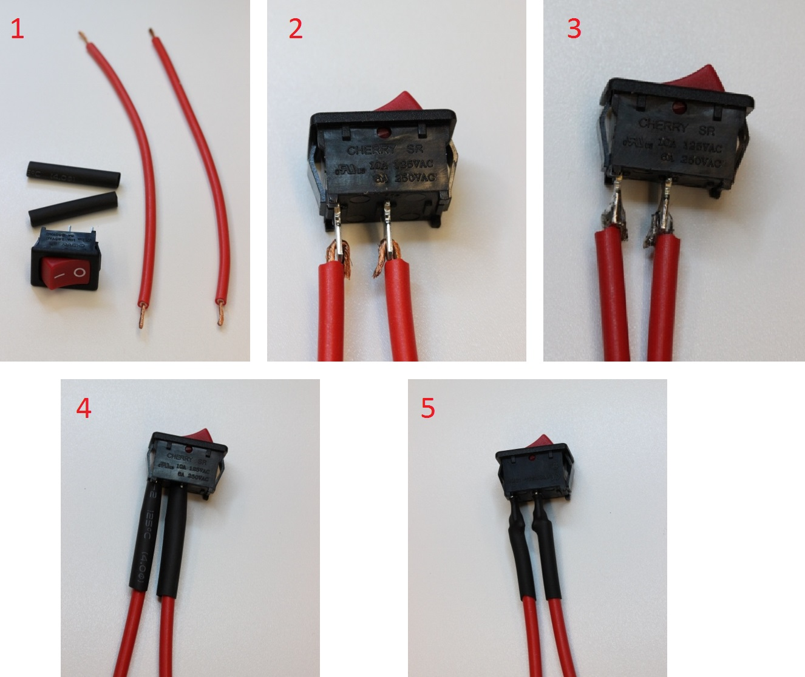

  - Strip about 1 cm of insulation from each end of the hookup wires
  - Thread the stripped portion of the wire halfway through each of the
    switch's solder terminals. Fold the wire back, so that the stripped part is
    touching both sides of the terminal.
  - Solder the hookup wire to the terminals. Make sure the solder flows between the
    wires' copper braid and the switch terminals.
  - Slide the heat shrink from the back of each wire, over the solder joints.
    Hit then with a hot air gun or pass a lighter underneath them to shrink
    them into place over the solder joints.

2. Prepare the panels

    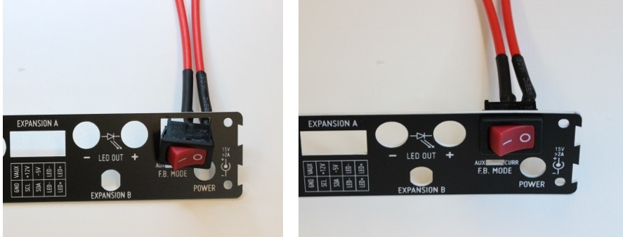

  - Pull the paper backing off the panels.
  - __Optional:__ Spray the inside of each panel with conductive EMI suppression.
    Additionally, you may want to file the inner edge of the enclosure to
    reveal the bare alumnimum to ensure good contact between the coating the
    rest of the enclosure. Allow the coating to dry before proceeding.
  - Press the  power switch into position on the back panel. Orient the switch
    so that the 'on' symbol (**-**) is toward the middle of the panel and the 'off'
    symbol (**o**) is toward the outside. This will make the panel easier to mount
    on the enclosure. Hold the panel close to hole you are pushing the switch
    into as the panel material is pretty thin and could break if it is bent too
    much.
  - The switch will snap into place.

3. Install the heatsink on the PCB if you have not already done so

    

  - Flip the PCB so that the bottom is exposed.
  - Locate the large white square surrounding the exposed copper pad indicating
    the heatsink mounting location
  - Remove the paper backing from the heatsink to expose the adhesive surface
  - Press the heatsink into place on the PCB

4. Solder the power switch to the PCB.

    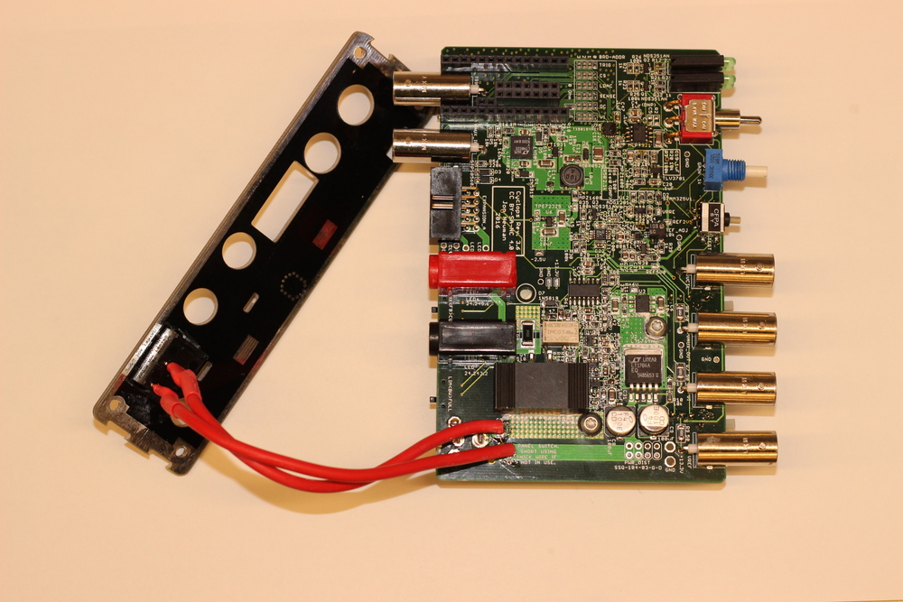

  - Solder the power switch to the two indicated terminals on the PCB.
  - Make sure you do this __after__ you have installed the switch in the rear
    panel.
  - The wires can be soldered to either solder point, orientation does not
    matter since this is a SPST switch.
  - __Optional:__ If you are using an EMI suppression coating, you should
    solder a third, fine gauge hookup wire to one of the GND test points on the
    board that you will eventually use to make electrical contact with the
    enclosure.

5. Install the light pipes on the PCB.

    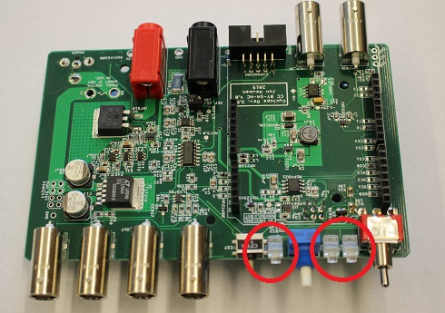

  - Insert the light pipes in the mounting positions in the front of the PCB.
  - Squeeze them into place firmly using some needle nose pliers or sturdy forceps.

6. Install the front panel on the enclosure

    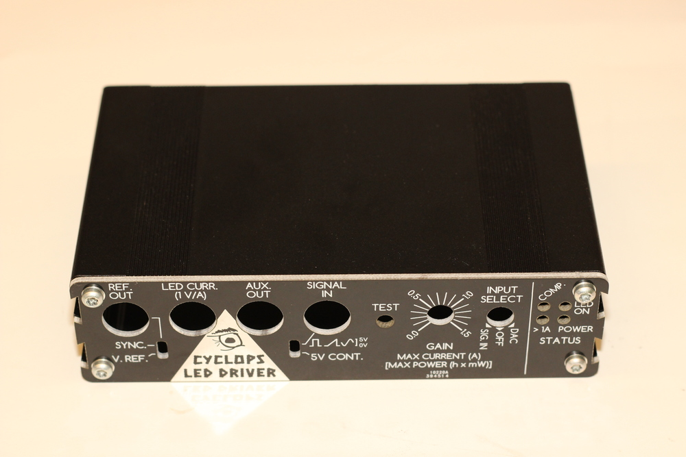

  - Using 4 of the 8 mount screws that came in with the enclosure, install the
    front panel on the enclosure.
  - __Optional:__ If you are using an EMI suppression coating, strip the end of
    the fine wire that was soldered to GND and insert it into one of the screw
    holes before inserting the screws. When the screws are turned in, this will
    provide electrical contact with the enclosure.
  - __Note:__ The holes should not have to be tapped. The screws should just
    kind of jam themselves into the holes. Godspeed.
  - __Note:__ The screws that come with the enclosure are what I would call
    "cheese grade". It is possible to break these screws so be cautious when
    turning them in. If you think you will break the screws,  then you might
    have to drill out the holes with twist drill to loosen them a bit. I have
    not had to resort to this yet.

7. Install the PCB in the enclosure.

    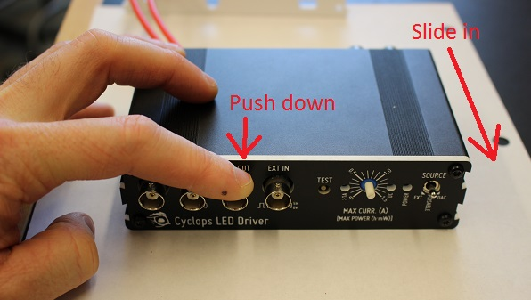

  - Slide the PCB into the box using the __middle__ mounting rail.
  - __Note:__ When the BNC connectors come through the front panel, you will
    need to push them down a bit, slightly flexing the PCB to get the light
    pipes through the front panel. This is required to hold the light pipes in
    place.
  - __Note:__ If you have installed an Arduino on your board, make sure you
    have removed the barrel jack power connector on the arduino first. If you
    leave it on the Arduino, it will press into the floor of the enclosure and
    possibly cause a short.

8. Install the rear panel.

    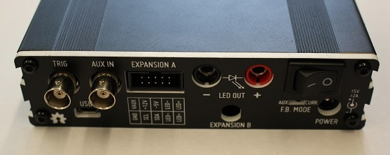

  - Loop the two hook up wires and push them into the enclosure on top of the
    PCB.
  - Use the panel the push the remaining wire into the enclosure.
  - Use the remaining 4 screws to install the rear panel.

9. Install gain knob and button cover.

    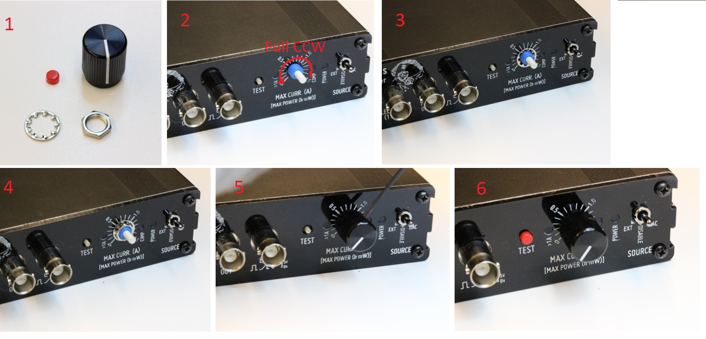

  - Slip the toothed washer over the gain dial.
  - Tighten the jam nut on the gain dial's threads until just past finger tight
    using a pair of needle nose pliers.
  - __Note:__ Do not over-tighten using a combination spanner or you will
    strip the threads.
  - Turn the dial on the front panel _fully counter-clockwise_.
  - Slip the gain knob over the dial with the tick mark pointed slightly below
    the 0 position.
  - Tighten the set screw on the side of the knob to lock it into place using
    an Allen key.
  - When you turn the knob fully clockwise, the tick mark should be pointing
    close to the 1.5A position.
  - Press the red cover over the `TEST` switch until it snaps into place.

Congratulations, you are the proud owner of a high-precision, high-power,
high-speed LED driver that will make commercial drives feel a bit ridiculous
for costing so much and very self-conscious about their performance
characteristics.

\FloatBarrier
\newpage

LED
---

There are several things to consider when determining the type of LED
you wish to drive with the Cyclops and the configuration of the LED.

- Will optical stimulation be used in-vivo or through a microscope?
- Will it be performed on freely behaving animals?
- Do you need to perform bilateral stimulation?
- Will you need to incorporate an amplified photodiode into your
  stimulator to measure optical power or use use optical feedback to
  produce ultra precise light waveforms?

The answers to these questions will determine the type of LED you use,
how it is coupled to the preparation (e.g. collimated for the back
aperture of your microscope or, fiber coupled for in-vivo stimulation),
and weather or not it needs to be commutated in some way. The following
provide a few simple options for LED configurations, but there are many
more to consider for your experiments.

Regardless of which you choose, the following is always true: **keep the
cabling to the LED as short as possible and 'fat' enough to handle high
currents (AWG 18 or thicker)**. The currents and voltage used to drive
high power LEDs are many orders of magnitude (like 6 or more...) greater
than those recorded during electrophysiology experiments. Also, the
Cyclops is a fast circuit. Fast circuits hate long cables because they
introduce appreciable delays and parasitics that can adversely affect
operating characteristics. Very long cables will introduce ringing into
light waveforms with fast edges! Ideally, the LED should be right next
to the device. I typically mount my fiber coupled LEDs directly into the
banana sockets on the back of the device using copper-clad printed
circuit board so that my 'cables' are about 2 cm in length.

### Fiber-coupled LED

#### DIY Solution

Anders Asp has contributed the following PDF document containing
detailed instructions for fabricating a bilateral, commutated
fiber-coupled LED for use in freely moving animals that works with the
Cyclops driver:

[Bilateral fiber-coupled LED](https://github.com/andersjasp/cyclops/blob/master/resources/Open_source_fiber-coupled_bilateral_LED_for_in_vivo_applications.pdf)

#### Thorlabs fiber-coupled LED modules

The cyclops can be used to Drive [Thorlabs fiber-coupled LED
modules](https://www.thorlabs.com/newgrouppage9.cfm?objectgroup_id=5206).  You
will need to install the [M8 4-position
connector](http://www.thorlabs.com/newgrouppage9.cfm?objectgroup_id=2615&pn=CON8ML-4#5315)
in expansion port B to drive these LEDs. Solder the wires from the connector to
the cyclops PCB as shown in the following image __after__ you have
installed the connector into the rear panel of the device.

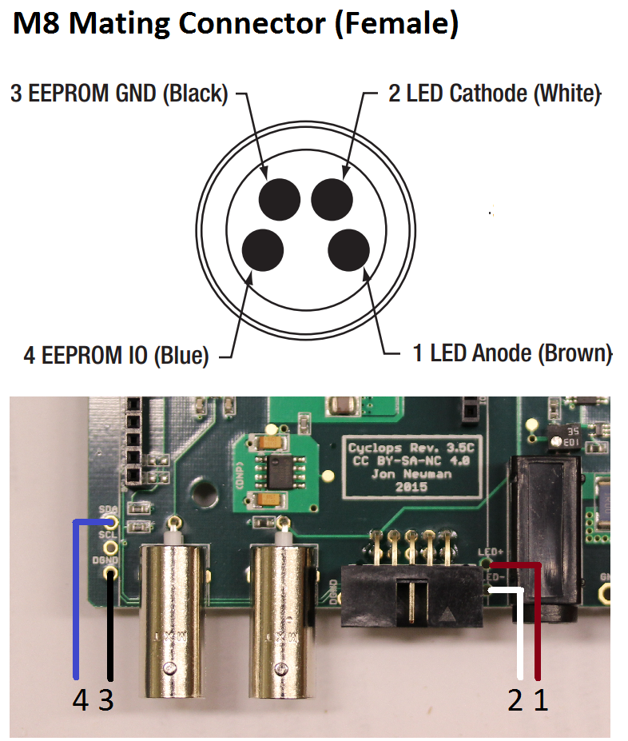

#### Doric LED fiber-coupled modules

The cyclops can be used to Drive [Doric fiber-coupled LED
modules](http://doriclenses.com/life-sciences/home/783-connectorized-single-led.html).
You will need to install the [M8 4-position
connector](http://www.thorlabs.com/newgrouppage9.cfm?objectgroup_id=2615&pn=CON8ML-4#5315)
in expansion port B to drive these LEDs.

TODO: Pictures/instructions for M8 installation process in Doric
configuration

### Microscope mounted LEDs

The cyclops can be used to Drive [Thorlabs collimated
LEDs](http://www.thorlabs.com/newgrouppage9.cfm?objectgroup_id=2615&pn=CON8ML-4#5315)
for microscope-based stimulation. You will need to install the [M8
4-position
connector](http://www.thorlabs.com/newgrouppage9.cfm?objectgroup_id=2615&pn=CON8ML-4#5315)
in expansion port B to drive these LEDs. See [Thorlab fiber-coupled LED
instructions](#thorlabs-fieber-coupled-led) for instructions.

\FloatBarrier
\newpage

Quality Control Procedure
-------------------------

The following procedure can be performed on assembled boards to ensure
functionality.

#### Setup

- Insert alligator clip across power switch solder points
- Insert device into PCB clamp
- Power from 15V, 1.5A capable bench-top power supply.
- [ ] Power indicator LED turns on.

#### DC Levels

- Using a multimeter, probe the 12V, 2.5V, -5V, and -1.25V test points
- [ ] 12V good
- [ ] -5V good
- [ ] -1.25V good
- [ ] While probing the 2.5V test point, use a ESD-safe screwdriver
    on the trimpot to get exactly 2.5V.
- [ ] Seal the pot with a dab of hot-glue.

#### Dynamic characteristics

- Set MDO3000's AFG to produce 1-5V, 100 Hz, 10% duty cycle
  square wave.
- Insert LED/amplified photodiode test fixture into banana sockets,
  IDC connector, and AUX BNC port.
- Insert AFG output of MDO3000 output into VCTL BNC port of device
- Bring CURR output of device to Ch1 of MDO3000
- Bring VREF output to MD3000
- Triggering on VREF Channel set scope to measure rise and fall times
- Bring front panel potentiometer to 50% position.
- Input switch to EXT source
- [ ] Examine wave shape and rise/fall times in **current** FB mode.
  Rise/fall times &lt; 300 ns. No ringing on waveform.
- [ ] Examine wave shape and rise/fall times in **optical** FB mode.
  Rise/fall times &lt; 300 ns. No ringing on waveform.
- [ ] **Return FB switch to curr position**
- [ ] Return input switch to OFF (middle) position

#### Overcurrent indication

- Bring gain potentiometer to full on position
- Briefly tap on the TEST button.
- [ ] Ensure that the &gt;1A indicator LED turned on during pulse.
- [ ] **Return gain potentiometer to zero position**

#### Finish

- [ ] Remove all power connectors.
- [ ] Remove alligator clip.
- [ ] Initial and serial number the board using sharpie on the large
  power trace on the right side of the board.
- [ ] Enter board serial number into the spreadsheet.

License
-------

### Hardware Licensing
 Cyclops
LED Driver by <a xmlns:cc="http://creativecommons.org/ns#"
href="https://github.com/jonnew/cyclops" property="cc:attributionName"
rel="cc:attributionURL">Jonathan P. Newman</a> is licensed under a
<a
rel="license" href="http://creativecommons.org/licenses/by-nc-sa/4.0/">Creative
Commons Attribution-NonCommercial-ShareAlike 4.0 International
License</a>. Based on a work at <a xmlns:dct="http://purl.org/dc/terms/"
href="https://github.com/jonnew/cyclops"
rel="dct:source">https://github.com/jonnew/cyclops</a>.

### Software Licensing
Copyright (c) Jonathan P. Newman All right reserved.

The code associated with the Cyclops project is free software: you can
redistribute it and/or modify it under the terms of the GNU General
Public License as published by the Free Software Foundation, either
version 3 of the License, or (at your option) any later version.

The code associated with the Cyclops project is distributed in the hope
that it will be useful, but WITHOUT ANY WARRANTY; without even the
implied warranty of MERCHANTABILITY or FITNESS FOR A PARTICULAR PURPOSE.
See the GNU General Public License for more details.

You should have received a copy of the GNU General Public License along
with this code. If not, see <http://www.gnu.org/licenses/>.

\FloatBarrier
\newpage

References
----------

\[1\] J.P. Newman, M.-f. Fong, D.C. Millard, C.J. Whitmire, G.B.
Stanley, S.M. Potter. S.M. Potter. [Optogenetic feedback control of
neural activity.](http://elifesciences.org/content/4/e07192v1) *eLife*
(4:e07192) 2015. doi: 10.7554/eLife.07192

\[2\] T. Tchumatchenko\*, J.P. Newman\*, M.-f. Fong, S.M. Potter.
[Delivery of time-varying stimuli using
ChR2](http://journal.frontiersin.org/article/10.3389/fncir.2013.00184/full#).
(\* - equal contributions, co-first authors) *Front. Neural Circuits*
(7:184) 2013. doi: 10.3389/fncir.2013.00184
