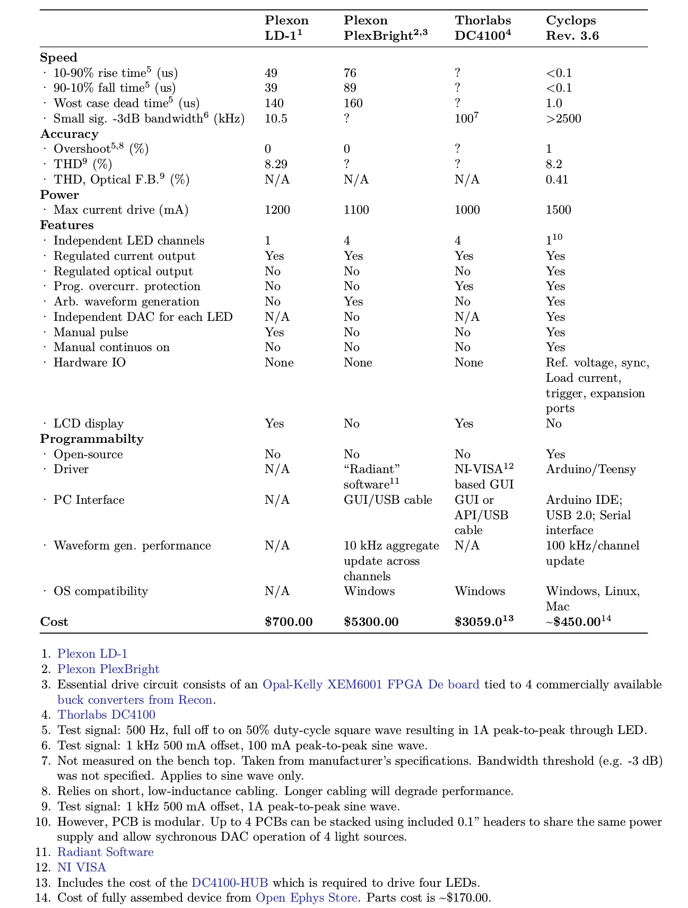

## Cyclops LED Driver
Precision, wide-bandwidth current source with optional optical feedback mode
for driving high-power LEDs and laser diodes. Good for sneaking optogenetic
stimuli between fast things (e.g. galvo flyback on a 2P system). Good for
_really_ controlling the amount of light you deliver during 1P imaging or
optogenetic stimulation.

If you have questions or comments, please come talk on the [open-ephys discord server](https://discord.gg/H2pH4Cp8xb) 
in the #stimulation channel.

### Features
- Ultra-precise
- High power
- Up to 1.5A per LED
- Wide bandwidth
    - \~2.5 MHz -3 dB bandwidth
    - Maximum 100 ns 1.0A rise and fall times
- Current and optical feedback modes
- Built-in waveform generation
- Over-current protection
- Modular
    - Arduino compatible: internal waveform generation
    - Also, accepts external analog, gate, or trigger inputs

### Stimulus generation options
- External stimulus sequencer
- External digital trigger
    - TTL logic level
- External analog waveform generator
    - 0-5V analog signals
- Internal 12-bit DAC
    - Synchronized across up to 4 drivers
    - Arduino library
    - Programmable triggering logic
    - Respond to USB input

### Buying one
You can purchase a fully assembled cyclops driver from the [open-ephys
store](https://open-ephys.org/cyclops-led-driver). All profits go towards continued
operation of open-ephys.

### Documentation
Documentation and usage information are here: [MANUAL.pdf](./MANUAL.pdf). If you
have questions concerning usage, performance, etc., please direct them toward
the [Open Ephys forum](https://groups.google.com/forum/#!forum/open-ephys).

### Hardware Licensing
Copyright Jonathan P. Newman 2020.

This work is licensed under CC BY-NC-SA 4.0. To view a copy of this license,
visit https://creativecommons.org/licenses/by-nc-sa/4.0

__Note__: This license applies to hardware designs and documentation which reside
in the 'device', 'experimental', 'resources' folders of this repository along
with information in 'MANUAL.md' and 'MANUAL.pdf'

### Software Licensing
Copyright (c) Jonathan P. Newman 2017. All right reserved.

The code associated with the Cyclops project is free software: you can
redistribute it and/or modify it under the terms of the GNU General Public
License as published by the Free Software Foundation, either version 3 of the
License, or (at your option) any later version.

The code associated with the Cyclops project is distributed in the hope that it
will be useful, but WITHOUT ANY WARRANTY; without even the implied warranty of
MERCHANTABILITY or FITNESS FOR A PARTICULAR PURPOSE.  See the GNU General
Public License for more details.

You should have received a copy of the GNU General Public License along with
this code.  If not, see <http://www.gnu.org/licenses/>.

__Note__: This license applies to software/fireware source code which resides in in
the 'lib' folder of this repository
